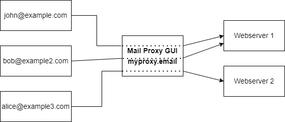
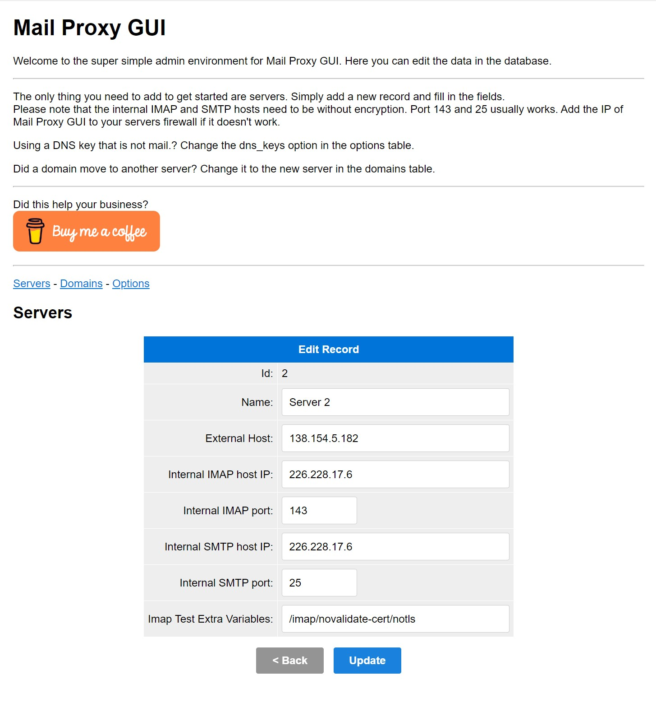
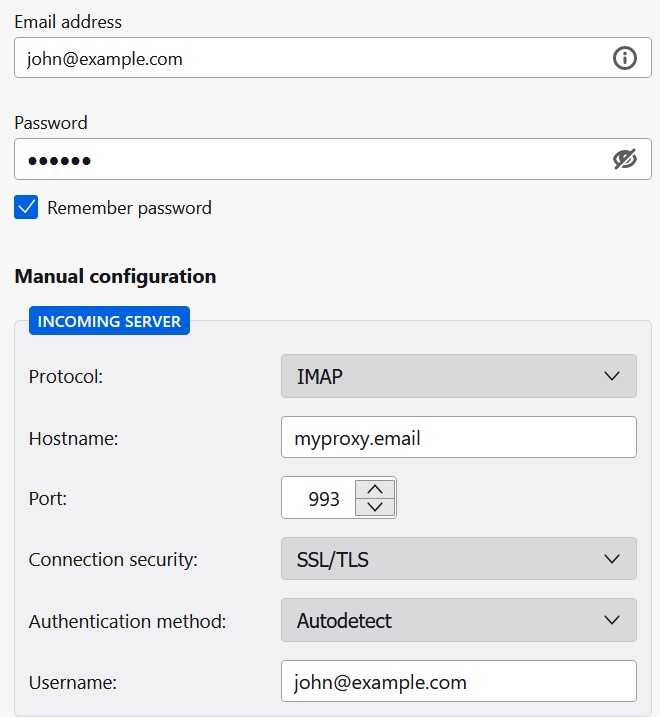

# Mail Proxy GUI



Welcome to Mail Proxy GUI. This simple systems allows you to configure and use a mail proxy. This is helpful when you
manage multiple servers, but want your clients to use one setting for incoming and outgoing mail.
This whole project is made in about 2 days and probably is not super secure, but it is a good start.

<a href="https://www.buymeacoffee.com/Lars-" target="_blank"></a>

## Features

* Simple GUI to configure everything
* Fully dockerized
* Connect multiple servers to one proxy

## Installation

Please install Docker and one of the latest versions of Docker Compose first.
This system runs the best on a server that is dedicated for this task. **Do you want us to host it for you?** Please
contact
us at support@ljpc.nl. It won't cost more than €10 per month, depending on the amount of users you expect to connect.

To install it on your server:

1. Clone this repo: ```cd /opt/ && git clone https://github.com/Lars-/MailProxyGUI.git```
2. Create an .env file: ```cp .env.example .env```
3. Change the values in the .env file to your needs. An SSL certificate is required for the system to work. Create one
   yourself or use Let's encrypt.
4. Run the following command: ```docker-compose up -d```
5. Add two DNS records for your domain: admin and @ which both point to your server.
6. Install a firewall and only allow the following ports: 25, 143, 587, 993, 110, 995. Do not allow port 8080 to be
   exposed to the internet, since that is the port to connect to the admin interface. Only you should have access to it.
7. Open your browser and go to http://admin.`your-domain`:8080
8. Add a server to the system

## Contribution

Please feel free to contribute to this project. This is a very basic project and can be improved in many, many ways.

## Donations

If you like this project and want to support it, you can donate to the
project [here](https://www.buymeacoffee.com/Lars-).

## Screenshots


